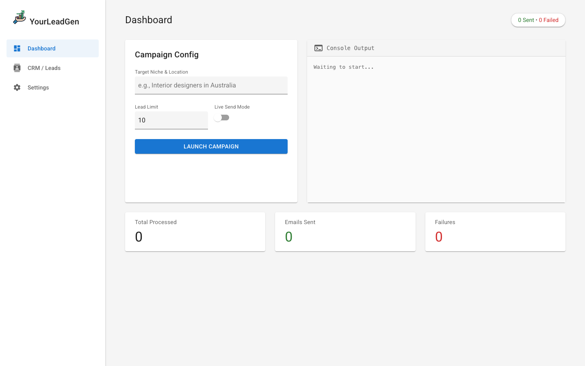
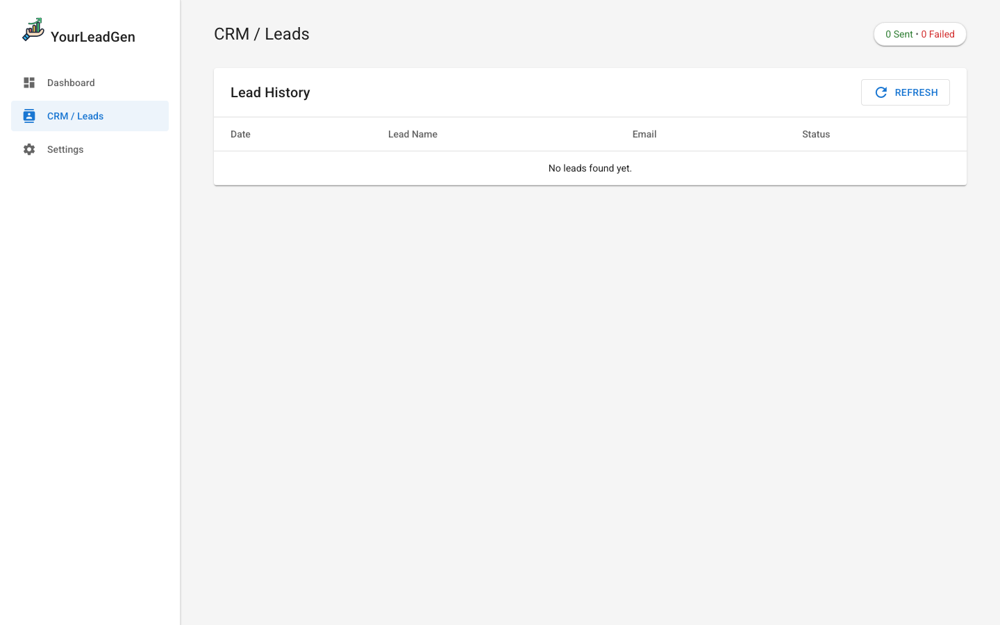
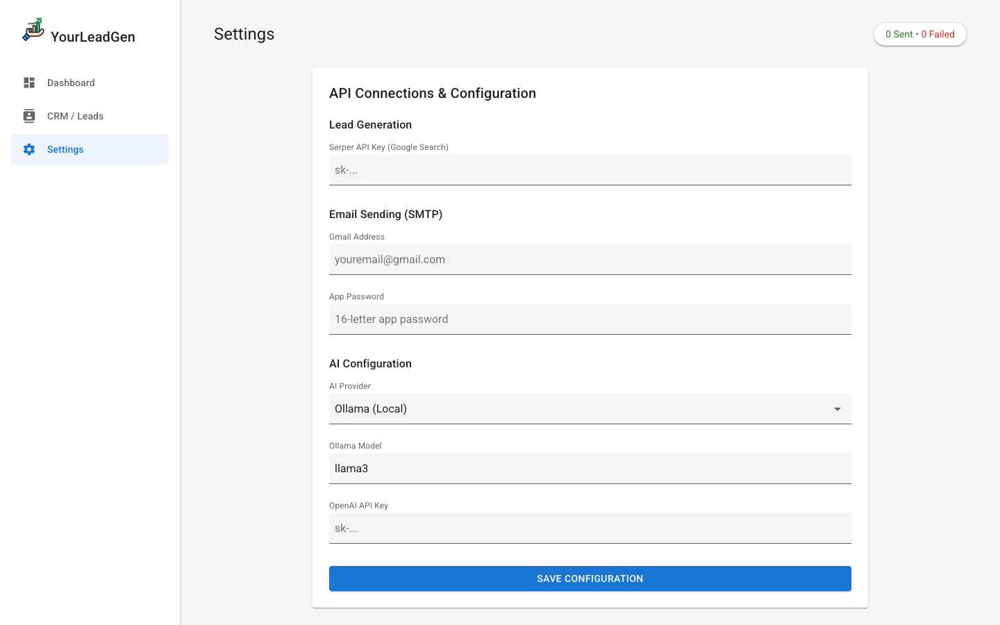

<br><div align="center">

# YourLeadGen

**The open-source AI outreach engine that turns a search query into a sent email campaign.**

[](https://nodejs.org/)
[](LICENSE)
[](CONTRIBUTING.md)
[](https://github.com/rounak695/YourLeadgen)

</div>

<br>

---

## Why this exists

Cold outreach is painful. You spend hours finding leads on Google, manually visiting their websites, copying emails into a spreadsheet, writing a personalized message (or worse, sending the same template to everyone), then sending one by one from your inbox hoping Gmail doesn't flag it.

I built YourLeadGen to automate that entire loop — find, scrape, write, send — from a single command. It runs locally on your machine, uses real Google Search data, and generates emails with your choice of AI model (including free, offline options via Ollama). No SaaS subscription. No vendor lock-in. No monthly bill.

You own the code. You own the data. You just run it.

<br>

---

## What it does

You type:

```
node main.js "Interior designers in Australia" --limit 10
```

And it:

1. Hits the **Serper API** to pull Google Search + Maps results for your query
2. **Scrapes each website** for emails, phone numbers, social profiles, and what they actually do
3. **Exports a CSV** of all scraped data to your Desktop automatically
4. **Writes a personalized cold email** for each lead using your configured AI model
5. **Sends the emails** through Gmail SMTP with rate limiting and duplicate prevention
6. **Logs every result** — sent, skipped, or failed — to a JSON file and the CRM dashboard

<br>

---

## The Dashboard

You don't have to touch a terminal at all. There's a full web dashboard at `localhost:3000`.

**Run a campaign, watch logs stream in real-time, check your CRM, and configure all your API keys — all from the browser.**

### Campaign Launcher



*Type your target niche and location, set a lead limit, toggle Live Send Mode on or off, and hit Launch. The console on the right streams the pipeline output in real-time as each lead is processed.*

<br>

### CRM / Lead History



*Every lead that's been processed shows up here with its status (sent / skipped / failed), email address, and timestamp. Starts empty until you run your first campaign.*

<br>

### Settings — Paste Your Keys Here



*No `.env` file editing required. Paste your Serper API key, Gmail credentials, and choose your AI provider directly in the browser. Keys are saved to your local `.env` instantly.*

<br>

---

## How the pipeline works


*The full system — from a CLI query to sent emails across 6 independent modules. Each module is self-contained and can be imported separately.*

Here's what each piece does:

| Module | File | What it does |
|--------|------|-------------|
| **Lead Fetcher** | `leadFetcher.js` | Calls Serper API (Google Maps + Search) to find businesses matching your query |
| **Scraper** | `scraper.js` | Visits each website, extracts emails, phones, socials, services, and about text via Cheerio |
| **CSV Export** | built into `main.js` | Auto-generates an RFC-compliant CSV with timestamps, saved to `~/Desktop` |
| **AI Generator** | `aiGenerator.js` | Calls your chosen AI provider to write a unique cold email for each lead |
| **Email Sender** | `emailSender.js` | Sends via Gmail SMTP with rate limiting, deduplication, and dry-run support |
| **Logger** | `logger.js` | Persists every attempt to `data/logs.json` for the CRM dashboard |

<br>

---

## What happens in the background

When you hit **Launch Campaign** in the dashboard, here's the exact sequence of events happening on your machine behind the scenes — useful if you're contributing or debugging:

**Step 1 — The browser sends a request to the local server**

The frontend calls `GET /api/run?query=...&limit=10&sendMode=false` on `server.js`. The server opens a **Server-Sent Events (SSE)** stream back to the browser so logs appear in real-time as the pipeline runs.

**Step 2 — `leadFetcher.js` calls the Serper API**

It hits `https://google.serper.dev/search` and `https://google.serper.dev/maps` with your query. The raw JSON response is parsed into a deduplicated list of `{ name, website, source }` objects. These are saved to `data/leads.json` as a local cache.

**Step 3 — `scraper.js` visits each website**

For every lead, it makes an HTTP GET request via Axios and parses the HTML with Cheerio. It scans for:
- `mailto:` links and any `@`-format strings that look like email addresses
- Phone numbers via regex patterns
- Social profile links (LinkedIn, Instagram, Facebook, Twitter)
- The `<meta name="description">` and any headings/paragraphs describing what the business does

Leads with no email found are marked `skipped` immediately and logged. Nothing is sent to them.

**Step 4 — `aiGenerator.js` crafts the email**

For leads that have an email, the scraped context (business name, description, services) is passed as a prompt to your configured AI provider. The prompt instructs the model to write a short, human, non-spammy cold email under 100 words. The model returns a JSON object: `{ subject, email_body }`. This is parsed with a triple-layer fallback (direct JSON parse → regex extraction → raw text).

**Step 5 — `emailSender.js` sends (or simulates) the email**

If **Live Send Mode is off**, the email is logged as `[DRY Run]` — nothing leaves your machine. If it's on, Nodemailer connects to Gmail SMTP over port 587 (TLS), sends the email, then waits a random delay between 30–120 seconds before processing the next lead. The same address is never emailed twice (checked against the existing log).

**Step 6 — `logger.js` records everything**

Every outcome — sent, skipped, or failed — is appended to `data/logs.json` with the business name, email, status, timestamp, and which AI-generated subject line was used. This is what powers the CRM tab in the dashboard.

<br>

---

## Getting started

### What you need

| Thing | Why | Cost |
|-------|-----|------|
| [Node.js 18+](https://nodejs.org/) | Runtime | Free |
| [Serper API key](https://serper.dev/) | Lead generation via Google Search | Free tier: 2,500 searches |
| Gmail + App Password | SMTP email delivery | Free |
| An AI provider | Writing the emails | Ollama = free & offline |

> **Cheapest setup:** Ollama (local, free) + Serper free tier. Your only ongoing cost is zero.

### Clone and install

```bash
git clone https://github.com/rounak695/YourLeadgen.git
cd YourLeadgen
npm install
```

### Start the dashboard

```bash
npm run dev
```

Open [http://localhost:3000](http://localhost:3000). Go to **Settings**, paste your keys, hit Save. Done.

### Or use the CLI directly

```bash
# Dry run — inspects leads, generates emails, but does NOT send anything
node main.js "Yoga studios in London" --limit 10

# Set a specific lead limit
node main.js "SaaS startups in San Francisco" --limit 5

# 🔴 LIVE MODE — actually sends emails
node main.js "Coffee shops in NYC" --send --limit 20

# Clear old logs before a fresh run
node main.js "Architects in Berlin" --clear-logs --limit 15
```

<br>

---

## Configuring your AI provider

Edit `.env` (or use the Settings tab) and set `AI_PROVIDER` to one of these:

| Provider | `AI_PROVIDER` value | Speed | Cost | Runs offline? |
|----------|---------------------|-------|------|---------------|
| [Ollama](https://ollama.com/) | `ollama` | Medium | Free | ✅ Yes |
| [OpenAI](https://openai.com/) | `openai` | Fast | Paid | ❌ No |
| [Groq](https://groq.com/) | `groq` | Very fast | Free tier | ❌ No |
| [Gemini](https://ai.google.dev/) | `gemini` | Fast | Free tier | ❌ No |
| [Claude](https://www.anthropic.com/) | `claude` | Fast | Paid | ❌ No |
| [Grok](https://x.ai/) | `grok` | Fast | Paid | ❌ No |

For Ollama (recommended to start), install it from [ollama.com](https://ollama.com), pull a model, and you're done:

```bash
ollama pull llama3
```

No API key needed. It runs entirely on your machine.

<br>

---

## Project structure

```
YourLeadgen/
│
├── server.js              ← Express server: dashboard API + SSE streaming
├── main.js                ← CLI entry point (standalone pipeline runner)
│
├── public/                ← Browser dashboard
│   ├── index.html         ← Layout: sidebar, tabs, forms
│   ├── style.css          ← Material Design UI
│   └── app.js             ← Frontend: tab switching, live logs, API calls
│
├── modules/
│   ├── leadFetcher.js     ← Serper API (Google Search + Maps)
│   ├── scraper.js         ← Website scraping (Axios + Cheerio)
│   ├── aiGenerator.js     ← Multi-provider AI (6 providers)
│   ├── emailSender.js     ← Gmail SMTP + rate limiting
│   ├── emailTemplate.js   ← HTML email templates
│   └── logger.js          ← JSON logging
│
├── config/
│   └── config.js          ← Dynamic config (reads from .env at runtime)
│
├── data/
│   ├── leads.json         ← Cached leads from last run
│   └── logs.json          ← Full campaign history (powers the CRM)
│
├── .github/workflows/     ← GitHub Actions CI/CD pipelines
│   ├── ci.yml             ← Automated testing and linting on push/PR
│   ├── node-matrix.yml    ← Compatibility testing across Node versions
│   ├── security-audit.yml ← Weekly dependency security scans
│   ├── release.yml        ← Automated NPM package publishing
│   └── github-packages.yml← Automated GitHub Packages publishing
│
├── .env.example           ← Copy this to .env and fill in your keys
├── SETUP.md               ← Detailed setup guide
├── CONTRIBUTING.md
└── LICENSE                ← MIT
```

<br>

---

## Safety and responsible outreach

This is built for genuine, personalized business outreach — not spam. A few non-negotiables are baked in:

- **Dry run is the default.** Emails only go out when you explicitly pass `--send` or toggle Live Send Mode in the dashboard.
- **Random delay between sends.** 30–120 seconds per email, randomized, to stay well under spam detection thresholds and Gmail limits.
- **Hard deduplication.** The same email address will never be contacted twice across runs, ever.
- **Junk email filter.** Auto-skips `noreply@`, `no-reply@`, `mailer@`, `postmaster@`, `support@`, and other non-human addresses.
- **Configurable daily cap.** Max 200 emails per run by default. Adjust in `config.js` if needed.

**Please comply with CAN-SPAM, GDPR, and your local email laws.**

<br>

---

## Contributing

Found a bug? Have an idea for a new AI provider, a smarter scraper, or a better email template? Pull requests are very welcome.

Check [CONTRIBUTING.md](CONTRIBUTING.md) for how to get started, and [CODE_OF_CONDUCT.md](CODE_OF_CONDUCT.md) for community standards.

<br>

---

## License

MIT — do what you want with it. See [LICENSE](LICENSE).

<br>

---

<div align="center">

Built with ☕ and 🧠 by [Rounak Paul](https://xcelaratestudio.space)

[](mailto:rounakpaul881@gmail.com)

*If this saved you time, a ⭐ on GitHub goes a long way.*

</div>
