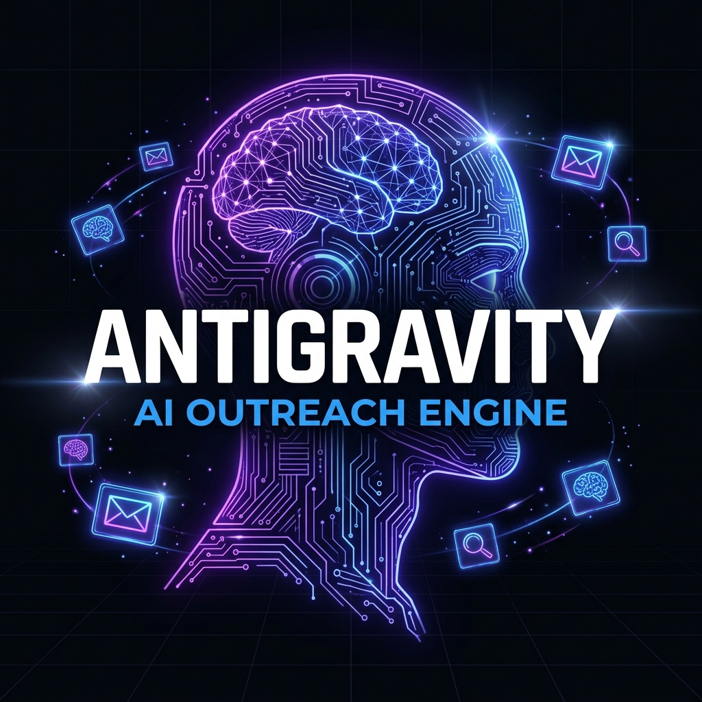
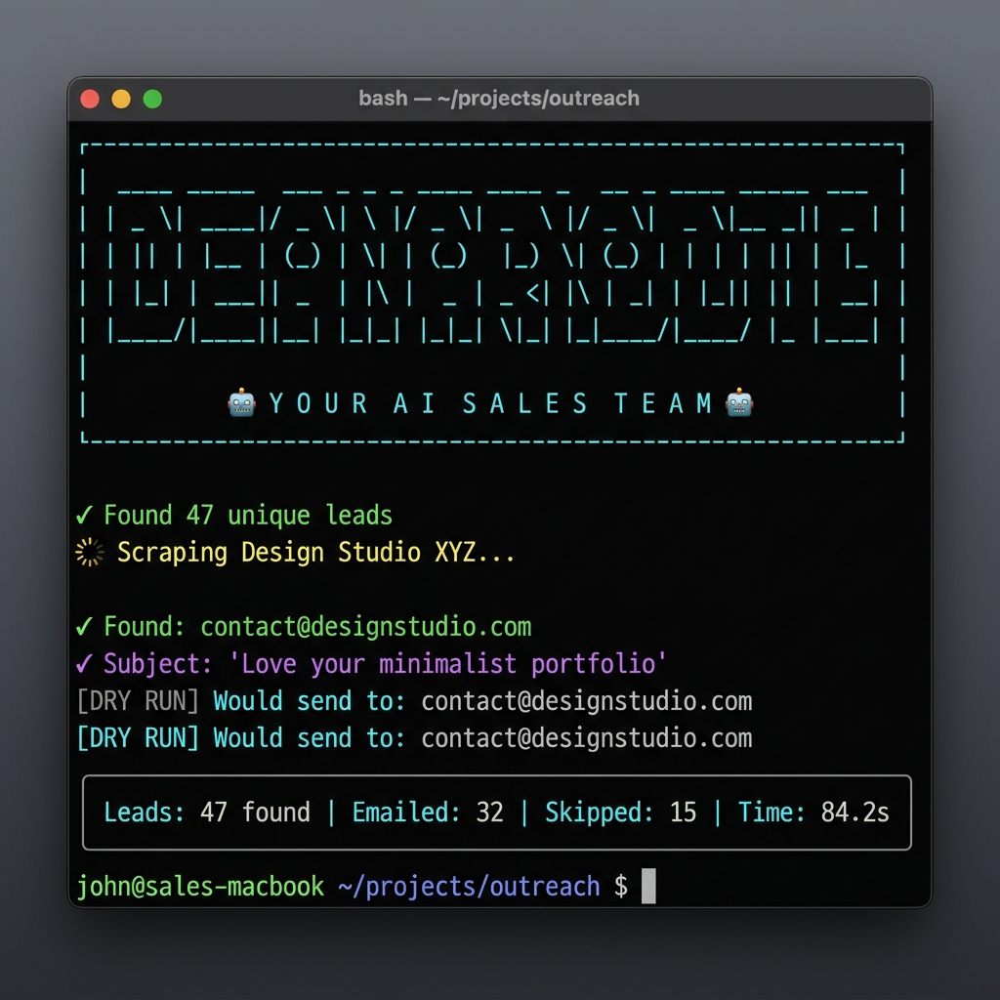
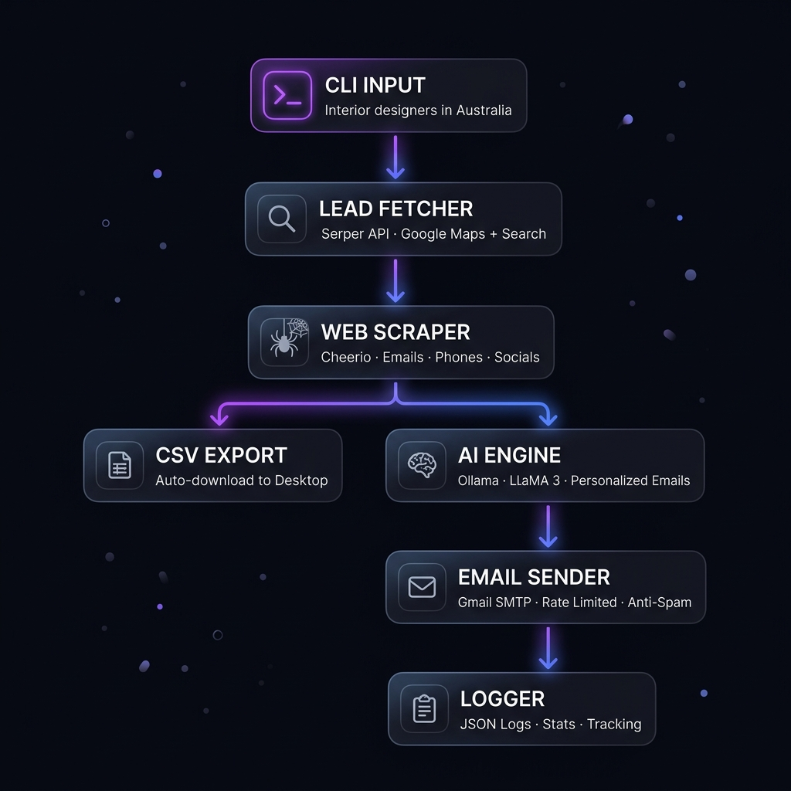
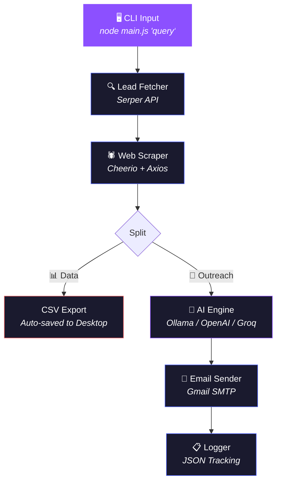

<br><div align="center">



<br>

# 🚀 YourLeadGen

### *The Open-Source Multi-AI Sales Outreach Machine*

<br>

[](https://nodejs.org/)
[](https://github.com/your-username/yourleadgen)
[](LICENSE)
[](https://support.google.com/a/answer/176600)
[](https://serper.dev/)
[](CONTRIBUTING.md)

<br>

**One command. Up to 200 leads. Personalized AI emails. Zero spam.**

[⚡ Quick Start](#-quick-start) · [🧠 How It Works](#-how-it-works) · [🤝 Contributing](CONTRIBUTING.md) · [🛡️ Safety](#%EF%B8%8F-safety--ethics)

</div>

<br>

---

<br>

## 💡 The Problem

> **Cold outreach is broken.**
>
> Sales teams spend **80% of their time** finding leads and writing emails that sound like every other templated garbage in someone's inbox. The result? **2% open rates**, burned domains, and wasted hours.

<br>

## ⚡ The Solution

**YourLeadGen** is a fully open-source AI automation engine that turns a single search query into a fully executed, *hyper-personalized* email campaign. It works securely on your local machine using **Ollama**, or connects instantly to **OpenAI, Groq, Gemini, Claude, and Grok**.

```
"Interior designers in Australia"
```

That's it. That's the input. YourLeadGen handles the rest:

| Step | What Happens | Tech |
|------|-------------|------|
| 🔍 **Find** | Discovers leads from Google Search + Maps | Serper API |
| 🕷️ **Scrape** | Extracts emails, phones, socials & business context | Cheerio |
| 📊 **Export** | Auto-generates a CSV dataset, saved to your Desktop | Node.js fs |
| 🧠 **Write** | Crafts a unique email for *each* lead | Ollama, OpenAI, Groq, etc. |
| 📧 **Send** | Delivers via Gmail SMTP with anti-spam safeguards (up to 200 emails) | Nodemailer |
| 📋 **Log** | Tracks every send/fail/skip with timestamps | JSON Logger |

<br>

---

<br>

## 🎬 See It In Action

<div align="center">



<br>

*▲ Real terminal output from a dry-run against interior design firms*

</div>

<br>

---

<br>

## 🏗️ Architecture

<div align="center">



<br><br>

*▲ The full pipeline — from a single query to sent emails in one command*

</div>

<br>

### System Design (Mermaid)



<br>

---

<br>

## ⚡ Quick Start

### Prerequisites

| Requirement | Why |
|------------|-----|
| [Node.js 18+](https://nodejs.org/) | Runtime |
| [Serper API Key](https://serper.dev/) | Lead generation (free tier: 2,500 queries) |
| Gmail App Password | SMTP email delivery |
| Any AI Provider | Choose from Ollama (local), OpenAI, Groq, Gemini, Claude, or Grok |

### 1️⃣ Clone & Install

```bash
git clone https://github.com/your-username/yourleadgen.git
cd yourleadgen
npm install
```

### 2️⃣ Configure Environment

```bash
cp .env.example .env
```

Edit `.env` with your credentials:

```env
# 🔑 Serper API (Lead Generation)
SERPER_API_KEY=your_serper_api_key_here

# 📧 Gmail SMTP (Email Sending)
SMTP_USER=your.email@gmail.com
SMTP_PASS=your_16_char_app_password
SMTP_FROM="Rounak Paul <your.email@gmail.com>"

# 🧠 Select your AI Provider (ollama, openai, groq, gemini, claude, grok)
AI_PROVIDER=groq
GROQ_API_KEY=gsk_your_api_key_here
```

### 3️⃣ Launch 🚀

```bash
# Dry run (no emails sent — just see what would happen)
node main.js "Interior designers in Australia"

# Limit to 5 leads for testing
node main.js "SaaS startups in San Francisco" --limit 5

# 🔴 LIVE MODE — actually sends emails
node main.js "Yoga studios in London" --send

# Clear previous logs
node main.js "Coffee shops in NYC" --clear-logs --limit 10
```

<br>

---

<br>

## 📖 Module Deep Dive

### 🤖 `aiGenerator.js` — The Multi-AI Writer
Connect to your preferred AI model. Keep your data private with local **Ollama** models, or use blazing-fast cloud APIs like **Groq**. All handled through standard REST endpoints without bloated SDKs.

**Supported Providers:**
- `ollama` (Local - Llama3, Mistral)
- `openai` (GPT-4o)
- `groq` (Llama3-70b)
- `gemini` (Gemini 1.5)
- `claude` (Claude 3)
- `grok` (Grok-2)

### 📨 `emailSender.js` — The Ethical Deliverer
Handles SMTP delivery with a built-in safety suite: rate limiting, duplicate prevention, and dry-run mode. Safely handles up to **200 emails per run**.

### 🕷️ `scraper.js` — The Intelligence Agent
Visits websites and extracts robust business data (emails, phones, social links, services) while gracefully skipping junk emails and dead domains.

<br>

---

<br>

## 🛡️ Safety & Ethics

YourLeadGen is built for **responsible outreach**:

| Safeguard | How It Works |
|-----------|-------------|
| 🧊 **Dry Run Default** | No emails are sent unless you explicitly pass `--send` |
| 📊 **Batch Limits** | Configured to process a safe maximum of 200 emails at a time |
| ⏱️ **Random Delays** | 30–120 second random wait between sends to mimic human behavior |
| 🔁 **Deduplication** | Same email address never receives more than one message |
| 🚫 **Junk Email Filter** | Auto-skips noreply, system, and platform-generated addresses |
| ↩️ **Unsubscribe** | Every generated email includes an unsubscribe option |

> [!IMPORTANT]
> **YourLeadGen is a tool for genuine, personalized business outreach — not spam.**
> Always comply with applicable email laws (CAN-SPAM, GDPR, etc.) in your jurisdiction.

<br>

---

<br>

## 🤝 Open Source & Contributing

YourLeadGen is proudly open-source and community-driven. We welcome contributions of all kinds!

- **Want to add a new AI provider?**
- **Found a bug in the scraper?**
- **Have an idea for a feature?**

Check out our [Contributing Guide](CONTRIBUTING.md) to get started, and please review our [Code of Conduct](CODE_OF_CONDUCT.md) to ensure a welcoming environment for everyone.

<br>

---

<br>

## 📝 License

This project is licensed under the **MIT License** — see the [LICENSE](LICENSE) file for details.

<br>

---

<br>

<div align="center">

### Built with 🧠 and ☕ by [Rounak Paul](https://xcelaratestudio.space) and the Open-Source Community.

<br>

[](mailto:rounakpaul881@gmail.com)

<br>

<sub>⭐ Support open-source AI tools — please drop a star! ⭐</sub>

</div>
